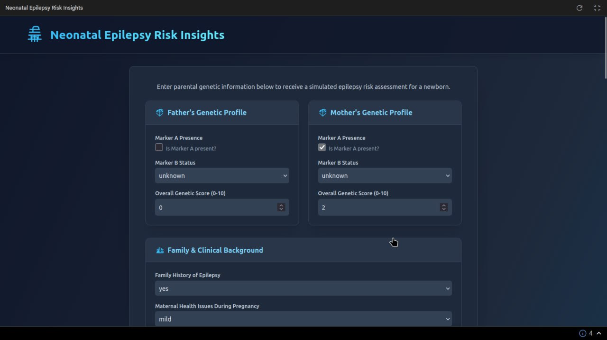

# Neonatal Epilepsy Risk Insights


> If you find this project helpful, please consider ⭐ [starring the repository](https://github.com/dragonpilee/neonatal-epilepsy-risk-insights)!

---

**Neonatal Epilepsy Risk Insights** is a conceptual web application designed to simulate the prediction of epilepsy risk in newborn babies. It utilizes parental genetic information, family history, and various perinatal/neonatal clinical factors as inputs. The application then provides a simulated risk assessment, visualizes contributing factors through charts, and offers AI-generated general recommendations (if a Google Gemini API key is configured).

**Developed by Alan Cyril Sunny.**

---



---

🚨 **IMPORTANT DISCLAIMER** 🚨

This application is a **conceptual tool for illustrative and educational purposes ONLY**. The predictions generated are based on **simulated data and a simplified model**.

- **NOT a substitute for professional medical advice, diagnosis, or treatment.**
- Always seek the advice of your physician or other qualified health provider with any questions you may have regarding a medical condition.
- Never disregard professional medical advice or delay in seeking it because of something you have read or seen on this application.
- The AI-generated recommendations are for informational purposes and should be discussed with healthcare professionals.

---

## ✨ Key Features

- **Comprehensive Input Form:** Collects detailed information across multiple categories:
    - Father's & Mother's Genetic Profiles (simulated markers and scores)
    - Family History of Epilepsy
    - Maternal Health Issues during pregnancy
    - Perinatal Factors (mother's age, gestational age, birth weight)
    - Neonatal Factors (Apgar scores, delivery complications, observed seizures)
- **Simulated Risk Prediction:** Generates a mock epilepsy risk score and level (Low, Moderate, High, Very High).
- **Contributing Factor Analysis:** Identifies and displays key (simulated) factors influencing the risk score.
- **Interactive Risk Chart:** Visualizes the impact of different factors using a bar chart (powered by Recharts).
- **AI-Powered Recommendations (Optional):** If a Google Gemini API key is provided, the application can generate personalized, general recommendations based on the simulated risk profile.
- **Responsive Design:** User-friendly interface accessible on various devices.
- **Clear Disclaimers:** Emphasizes the non-medical, conceptual nature of the tool.

---

## 🛠️ Technologies Used

- **Frontend:** React 19, TypeScript
- **Styling:** Tailwind CSS
- **Charting:** Recharts
- **AI Integration:** Google Gemini API (`gemini-2.5`) for generating recommendations.
- **Build/Module System:** ES Modules directly in the browser (via `importmap` in `index.html`).

---

## 🚀 Getting Started

This project is designed to run directly in a modern browser using ES Modules and CDNs for dependencies like React, Recharts, and Tailwind CSS.

### Prerequisites

- A modern web browser (e.g., Chrome, Firefox, Edge, Safari).
- An internet connection (to load CDN resources).
- **(Optional but Recommended for AI Features)** A Google Gemini API Key.

### Setup and Running

1. **Clone the repository (or download the files):**
    ```bash
    git clone <repository-url>
    cd <repository-directory>
    ```

2. **Set up the API Key (for AI Recommendations):**
    - The application looks for the Google Gemini API key in `process.env.API_KEY`. Since this is a client-side application without a Node.js backend to manage environment variables in the traditional sense, you'll need to make this available to the `geminiService.ts` script.
    - **For local development/testing, you can temporarily hardcode it in `services/geminiService.ts` (NOT recommended for production or sharing):**
        ```typescript
        // filepath: services/geminiService.ts
        // ...existing code...
        const getApiKey = (): string => {
          // const apiKey = process.env.API_KEY; // Original
          const apiKey = "YOUR_ACTUAL_API_KEY"; // Replace with your key for local testing
          if (!apiKey) {
            throw new Error("API_KEY environment variable not set or hardcoded key is missing.");
          }
          return apiKey;
        };
        // ...existing code...
        ```
        **Remember to remove your key before committing or sharing your code.**

3. **Open `index.html` in your browser:**
    - Navigate to the project directory.
    - You can usually just double-click the `index.html` file, or right-click and choose "Open with" your preferred browser.
    - Alternatively, serve the directory using a simple HTTP server (e.g., `npx serve` or Python's `http.server`) and open the provided local URL.

### Using the Application

1. Fill in the required fields in the "Parental Genetic Profiles," "Family & Clinical Background," and "Perinatal & Neonatal Factors" sections.
2. Click the "Get Risk Assessment" button.
3. View the simulated results, including the overall risk score, risk level, contributing factors chart, summary, and (if API key is configured) AI-generated recommendations.

---

## 📂 Project Structure

```
.
├── public/
│   └── (No public assets currently, index.html serves as base)
├── src/
│   ├── components/                 # React UI components
│   │   ├── Footer.tsx
│   │   ├── Header.tsx
│   │   ├── Icons.tsx               # SVG Icons
│   │   ├── InfoCard.tsx            # Reusable card for sections
│   │   ├── InputForm.tsx           # Main data input form
│   │   ├── ResultsDisplay.tsx      # Displays prediction results
│   │   ├── RiskChart.tsx           # Bar chart for risk factors
│   │   ├── Spinner.tsx             # Loading spinner
│   │   └── ErrorMessage.tsx        # Error display component
│   ├── services/
│   │   └── geminiService.ts        # Mock prediction logic & Gemini API integration
│   ├── App.tsx                     # Main application component
│   ├── constants.ts                # Application-wide constants
│   ├── index.tsx                   # React entry point
│   └── types.ts                    # TypeScript type definitions
├── .env.example                    # Example for environment variables (API Key)
├── index.html                      # Main HTML file with import maps & Tailwind CSS
├── metadata.json                   # Application metadata
├── package.json                    # Project dependencies (conceptual, as it runs via CDN)
├── README.md                       # This file
└── tsconfig.json                   # TypeScript configuration (conceptual)
```

---

## Notes

- The risk predictions are simulated and for educational illustration only.
- Ensure your browser supports ES Modules and modern JavaScript features.
- The application is designed to be responsive and accessible.

---

This README provides a comprehensive guide to the Neonatal Epilepsy Risk Insights application.  
Remember the critical importance of the disclaimer: **this is not a medical tool.**
